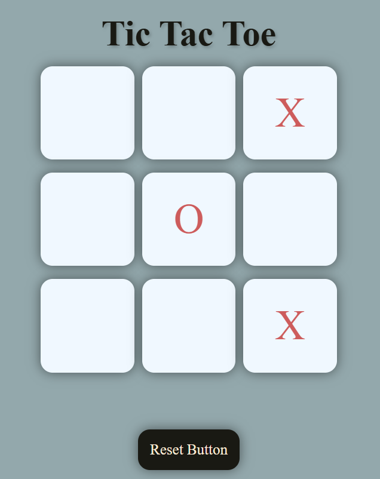

# Tic Tac Toe 🎮

A simple **Tic Tac Toe game** built using **HTML, CSS, and JavaScript**. Play with a friend on a 3x3 grid and enjoy the classic game.

## How to Run
1. Clone the repo:
   ```bash
   git clone https://github.com/your-username/tic-tac-toe.git
   cd tic-tac-toe

2. Open the **index.html** file in any web browser.
   
## Rules
✔ Player 1 → X, Player 2 → O  
✔ Players take turns marking empty squares  
✔ First to align 3 marks (row, column, diagonal) wins  
✔ All squares filled with no winner → Draw  

## Features
✔ Two-player mode  
✔ Win/draw detection  
✔ Easy to run & modify  
✔ Simple and clean UI  
✔ Lightweight and beginner-friendly code  

## Screenshots

